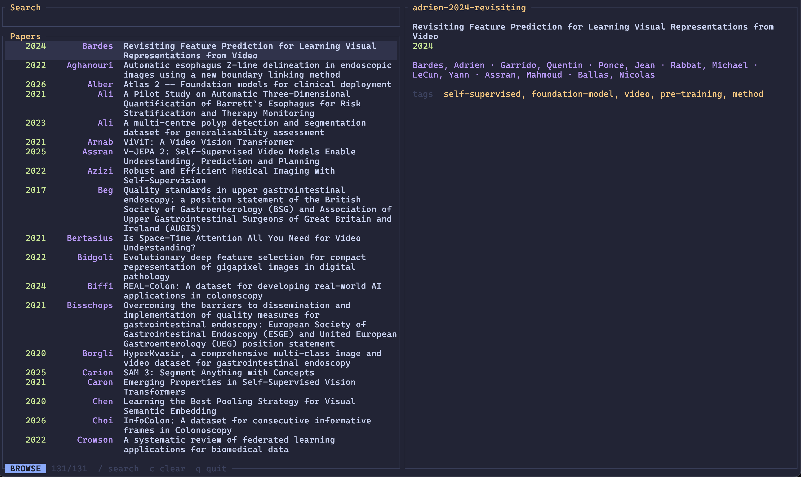

# Grimoire

A fast TUI reference manager.



## Install

Requires Rust.

```
cargo install --path .
```

Or with just:

```
just install
```

## Development

Run the same formatting, compilation, lint, and test checks used by CI:

```sh
just check-all
```

## Usage

```
grimoire                          # browse library
grimoire jepa                     # browse with "jepa" pre-filled
grimoire add 1706.03762           # import by arXiv ID (fetches metadata + PDF)
grimoire add 10.1038/nature14539  # import by DOI (fetches metadata)
grimoire add paper.pdf            # import local PDF
grimoire add 1706.03762 2201.1234 # batch import (each input handled independently)
grimoire add --force 1706.03762   # import even if a matching DOI/title already exists
grimoire cite --format typst      # pick a reference, output @cite-key
grimoire export --format yaml     # dump all references to stdout as YAML
grimoire export --format hayagriva # ...or json / bibtex / hayagriva (Typst)
grimoire export -f bibtex --tag video -o refs.bib  # filter by tag, write to a file
grimoire reindex                  # rebuild search index from filesystem
grimoire validate                 # check library integrity
grimoire validate --fix           # auto-fix issues (rename temp files, remove junk)
grimoire completions fish         # emit a shell completion script
```

### TUI keybindings

| Key | Action |
|-----|--------|
| `j / k` | Move down / up |
| `g / G` | Jump to top / bottom |
| `/ or i` | Enter search mode |
| `enter` | Open PDF (browse), confirm search (search) |
| `e` | Edit info.toml |
| `y` | Copy BibTeX |
| `o` | Open DOI / arXiv in browser |
| `a` | Add paper (path, DOI, arXiv ID, URL) |
| `r` | Enrich selected (fetch metadata) |
| `R` | Enrich all with missing fields |
| `s` | Cycle sort (name/author/year/title) |
| `d` | Deduplicate library |
| `I` | Reindex library |
| `V` | Validate library (auto-fix) |
| `t` | Browse tags |
| `T` | Switch theme |
| `space` | Toggle full-screen abstract (Quick Look) |
| `L` | Cycle layout (full/wide/tall) |
| `?` | Help |
| `q` | Quit |

## Library layout

```
~/Papers/
  vaswani-2017-attention/
    info.toml
    vaswani-2017-attention.pdf
  lecun-2015-deep/
    info.toml
```

Directory naming: `{first-author}-{year}-{first-title-word}`.

### info.toml

```toml
title = "Attention Is All You Need"
authors = ["Ashish Vaswani", "Noam Shazeer", "Niki Parmar"]
year = 2017
arxiv = "1706.03762"
tags = ["transformers", "nlp"]
files = ["vaswani-2017-attention.pdf"]
abstract = """
The dominant sequence transduction models are based on complex recurrent or
convolutional neural networks...
"""
```

## Configuration

Optional. Grimoire works without any config file.

`~/.config/grimoire/config.toml`:

```toml
library = "~/Papers"       # default
editor = ["hx"]             # string or command plus arguments; defaults to $EDITOR or "vi"
reader = ["open"]           # PDF opener; defaults to $GRIM_READER or the OS opener
browser = ["open"]          # URL opener; defaults to $BROWSER or the OS opener
theme = "tokyo-night-moon" # default
layout = "full"            # full (default), wide, tall, or auto; auto detects wide/tall
```

Command values accept either a string (`reader = "zathura"`) or an argument array
(`reader = ["open", "-a", "Preview"]`). Grimoire appends the file path or URL.

Environment variables: `$GRIM_LIBRARY`, `$GRIM_READER`, `$BROWSER`, `$EDITOR`.

## Helix integration

Add to `~/.config/helix/config.toml`:

```toml
[keys.normal.space.r]
r = [":insert-output grimoire cite", ":redraw"]
t = [":insert-output grimoire cite --format typst", ":redraw"]
l = [":insert-output grimoire cite --format latex", ":redraw"]
```

`Space r t` in normal mode opens Grimoire and inserts a Typst citation at the cursor.

## Smart import

`grimoire add` detects the input type automatically:

- **arXiv ID** (`1706.03762`) — fetches metadata from arXiv API, downloads PDF
- **arXiv URL** (`https://arxiv.org/abs/1706.03762`) — same
- **PMC URL** (`https://pmc.ncbi.nlm.nih.gov/articles/PMC1234567/`) — resolves metadata and downloads an available publisher or PMC Open Access PDF
- **DOI** (`10.1038/nature14539`) — fetches metadata from CrossRef
- **Direct PDF URL** — downloads only when the response contains PDF data
- **Local PDF** (`paper.pdf`) — extracts metadata from PDF; if filename looks like an arXiv ID, fetches metadata from arXiv

If an incoming reference matches an existing entry by DOI or normalized title,
`add` warns and skips it; pass `--force` to import anyway. The interactive
deduplicator (`d` in the TUI) groups existing references that share a title
**or** DOI so you can merge them after the fact.
