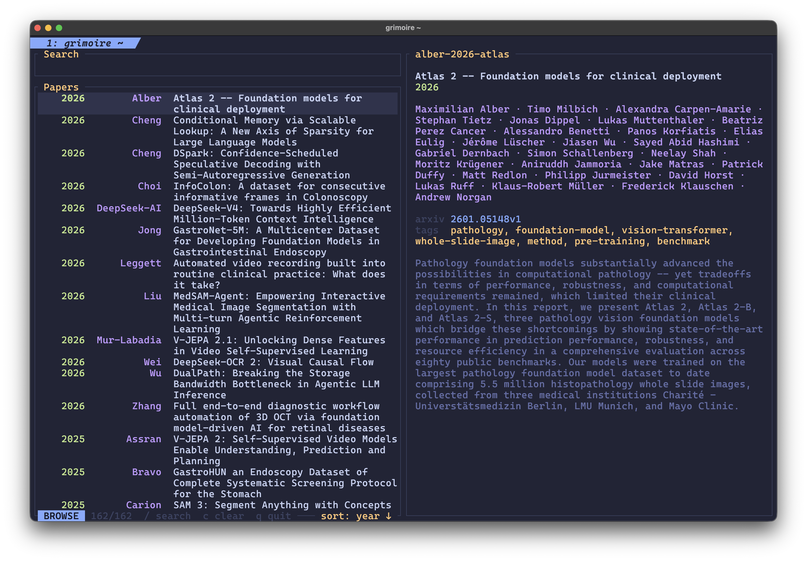

# Grimoire

A fast, local-first scholarly library for papers and books.



## Install

Requires Rust. Source-PDF formula previews are optional and require Kitty plus
`pdftoppm` from Poppler (`brew install poppler` on macOS).

```
cargo install --path .
```

Or with just:

```
just install
```

## Development

Run the same formatting, compilation, lint, and test checks used by CI:

```sh
just check-all
```

## Usage

```
grimoire                          # browse library
grimoire jepa                     # browse with "jepa" pre-filled
grimoire add 1706.03762           # import by arXiv ID (fetches metadata + PDF)
grimoire add 10.1038/nature14539  # import by DOI (fetches metadata)
grimoire add paper.pdf            # import local PDF
grimoire add --kind book --title "Understanding Analysis" --author "Stephen Abbott" book.pdf
grimoire import-derived abbott-2015-understanding --docling document.json
grimoire add 1706.03762 2201.1234 # batch import (each input handled independently)
grimoire add --force 1706.03762   # import even if a matching DOI/title already exists
grimoire cite --format typst      # pick a reference, output @cite-key
grimoire list --tag video         # list references without opening the TUI
grimoire show vaswani-2017-attention # show one reference by exact key
grimoire search "attention model" # lexical full-text search
grimoire path vaswani-2017-attention # print the local PDF path
grimoire update vaswani-2017-attention --add-tag foundational # preview metadata edit
grimoire update vaswani-2017-attention --add-tag foundational --apply # write it
grimoire enrich vaswani-2017-attention # preview missing metadata fetched from sources
grimoire enrich vaswani-2017-attention --apply # write fetched metadata
grimoire dedup                    # inspect duplicate groups without changing files
grimoire dedup --keep vaswani-2017-attention --apply # move rejected copies to .trash
grimoire export --format yaml     # dump all references to stdout as YAML
grimoire export --format hayagriva # ...or json / bibtex / hayagriva (Typst)
grimoire export -f bibtex --tag video -o refs.bib  # filter by tag, write to a file
grimoire backfill                 # fetch missing PDFs + abstracts for existing entries
grimoire backfill --check         # report how many entries are missing a PDF / abstract
grimoire backfill --pdfs-only     # only download missing PDFs (open-access)
grimoire reindex                  # rebuild search index from filesystem
grimoire semantic-index           # embed new or changed JSONL passages
grimoire semantic-index --force   # rebuild every passage embedding
grimoire semantic "retrieval limitations"  # works ranked by their best passage
grimoire semantic "monotone convergence" --exact # exact-term filter + similarity rank
grimoire semantic "retrieval limitations" --per-paper 3 # include top 3 passages per work
grimoire semantic "retrieval limitations" --group passages # raw passage ranking
grimoire semantic "retrieval limitations" --offset 100 # fetch the next CLI page
grimoire semantic "retrieval limitations" --all # explicitly return every result
grimoire validate                 # check library integrity
grimoire validate --fix           # auto-fix issues (rename temp files, remove junk)
grimoire completions fish         # emit a shell completion script
```

### TUI keybindings

| Key | Action |
|-----|--------|
| `j / k` | Move down / up |
| `g / G` | Jump to top / bottom |
| `/ or i` | Enter search mode |
| `v` | Search indexed works semantically |
| `enter` | Open PDF (browse), confirm search (search) |
| `e` | Edit info.toml |
| `y` | Copy BibTeX |
| `o` | Open DOI / arXiv in browser |
| `a` | Add work (path, DOI, arXiv ID, URL) |
| `r` | Enrich selected (fetch metadata) |
| `R` | Enrich all with missing fields |
| `s` | Cycle sort (name/author/year/title) |
| `d` | Deduplicate library |
| `I` | Reindex library |
| `V` | Validate library (auto-fix) |
| `t` | Browse tags |
| `T` | Switch theme |
| `space` | Toggle full-screen abstract (Quick Look) |
| `L` | Cycle layout (full/wide/tall) |
| `?` | Help |
| `q` | Quit |

Semantic results start as one row per work, ordered by that work's strongest
matching passage. Lowercase `p` toggles between the selected work and its
ranked passages; `l` or Right also opens them. Uppercase `P` toggles between
grouped works and the global raw-passage ranking. From either passage view,
`h` or Left returns to the grouped work results; `esc` also returns from a
selected work's passages. In every view, `j / k` moves, `space` expands the
selected match, `enter` opens its PDF at the indexed page, and `v` starts
another semantic query.

## Agentic CLI

Core library browse and maintenance actions have noninteractive counterparts;
theme selection, layout changes, and passage expansion remain presentation-only
TUI actions. Use exact keys from `list`, `search`, or `semantic` to avoid
ambiguous selection:

```sh
grimoire --json list --query "visual representation" --tag video
grimoire --json show vaswani-2017-attention
grimoire --json search "transformer architecture"
grimoire --json semantic "limitations of self-supervised video models"
grimoire --json semantic "monotone convergence theorem" --exact
grimoire --json semantic "limitations" --per-paper 3
grimoire --json semantic "limitations" --group passages
grimoire --json semantic "limitations" --limit 100 --offset 100
grimoire --json semantic "limitations" --all
grimoire --json cite vaswani-2017-attention --format typst
grimoire --json path vaswani-2017-attention
grimoire --json validate
grimoire --json backfill --check
```

`--json` writes one stable envelope to stdout with `ok`, `data`, `warnings`,
and `errors` fields. Diagnostics and download progress go to stderr. `export`
is the exception because it emits the requested interchange format directly;
use `export --format json` for machine-readable export data.

Metadata and filesystem mutations are guarded. `update` and `enrich` show a
dry-run diff unless `--apply` is present. `dedup` only removes entries when each
duplicate group has an explicit `--keep <key>` and `--apply`; removed directories
are moved to the library's `.trash` directory. `validate --fix`, `backfill`,
`reindex`, `semantic-index`, and `add` retain their command-specific mutation
semantics.

## Library layout

```
~/Papers/
  vaswani-2017-attention/
    info.toml
    vaswani-2017-attention.pdf
  lecun-2015-deep/
    info.toml
  abbott-2015-understanding/
    info.toml
    Abbott-Understanding_Analysis.pdf
    derived/docling/
      document.json
      passages.jsonl
```

Books use the same directory layout and citation key scheme. Their metadata is
flat and backward-compatible with existing paper entries:

```toml
kind = "book"
title = "Understanding Analysis"
authors = ["Stephen Abbott"]
year = 2015
edition = "2"
publisher = "Springer"
series = "Undergraduate Texts in Mathematics"
isbn = ["978-1-4939-2711-1", "978-1-4939-2712-8"]
doi = "10.1007/978-1-4939-2712-8"
files = ["Abbott-Understanding_Analysis.pdf"]
```

Directory naming: `{first-author}-{year}-{first-title-word}`.

### info.toml

```toml
title = "Attention Is All You Need"
authors = ["Ashish Vaswani", "Noam Shazeer", "Niki Parmar"]
year = 2017
arxiv = "1706.03762"
tags = ["transformers", "nlp"]
files = ["vaswani-2017-attention.pdf"]
abstract = """
The dominant sequence transduction models are based on complex recurrent or
convolutional neural networks...
"""
```

## Configuration

Optional. Grimoire works without any config file.

`~/.config/grimoire/config.toml`:

```toml
library = "~/Papers"       # default
editor = ["hx"]             # string or command plus arguments; defaults to $EDITOR or "vi"
reader = ["open"]           # PDF opener; defaults to $GRIM_READER or the OS opener
browser = ["open"]          # URL opener; defaults to $BROWSER or the OS opener
theme = "~/.config/themes/tokyo-night-moon.toml"
theme_catalog = "~/.config/themes/catalog.toml"
layout = "full"            # full (default), wide, tall, or auto; auto detects wide/tall
# semantic_results = 25     # optional TUI result cap; omitted or zero returns all
```

`theme` is loaded directly. `theme_catalog` contains an explicit `themes = [...]`
array used by the picker. Grimoire never scans a theme directory. Picker changes
apply to the current session only and never rewrite `config.toml`; edit `theme`
directly to change the startup theme. The files in
[`themes/`](themes/) are examples. If `theme` is unset or its file cannot be
loaded, Grimoire uses the terminal's default colors.
The palette's `bg` color fills the interface background; `[ui].background` can
name a different palette color when needed.

Command values accept either a string (`reader = "zathura"`) or an argument array
(`reader = ["open", "-a", "Preview"]`). Grimoire appends the file path or URL.

Environment variables: `$GRIM_LIBRARY`, `$GRIM_READER`, `$GRIM_EDITOR` (or
`$EDITOR`), `$GRIM_BROWSER` (or `$BROWSER`). The `GRIM_`-prefixed names take
precedence.

## Helix integration

Add to `~/.config/helix/config.toml`:

```toml
[keys.normal.space.r]
r = [":insert-output grimoire cite", ":redraw"]
t = [":insert-output grimoire cite --format typst", ":redraw"]
l = [":insert-output grimoire cite --format latex", ":redraw"]
```

`Space r t` in normal mode opens Grimoire and inserts a Typst citation at the cursor.

## Smart import

`grimoire add` detects the input type automatically:

- **arXiv ID** (`1706.03762`) — fetches metadata from arXiv API, downloads PDF
- **arXiv URL** (`https://arxiv.org/abs/1706.03762`) — same
- **PMC URL** (`https://pmc.ncbi.nlm.nih.gov/articles/PMC1234567/`) — resolves metadata and downloads an available publisher or PMC Open Access PDF
- **PubMed URL / PMID** (`https://pubmed.ncbi.nlm.nih.gov/26017442/`, `PMID:26017442`) — resolves the DOI via NCBI, then fetches metadata from CrossRef
- **DOI** (`10.1038/nature14539`) — fetches metadata from CrossRef; if no PDF is otherwise available, tries Unpaywall for an open-access copy
- **DOI or doi.org URL** — a DOI embedded anywhere in a URL (e.g. a PLoS `?id=10.1371/…` link) is extracted automatically
- **Publisher landing page** (`https://www.nature.com/articles/…`, ScienceDirect, Springer, etc.) — scrapes the page's `citation_doi` / `citation_pdf_url` meta tags to resolve metadata and, when the PDF is openly available, download it
- **Direct PDF URL** — downloads only when the response contains PDF data
- **Local PDF** (`paper.pdf`) — extracts metadata from PDF; if filename looks like an arXiv ID, fetches metadata from arXiv
- **Local book PDF** — pass `--kind book` plus any explicit `--title`,
  `--author`, `--year`, `--edition`, `--publisher`, `--series`, `--isbn`, and
  `--doi` overrides. Metadata overrides require a single local PDF.

> **Prefer the DOI for publisher pages.** Some sites can't be imported from
> their article URL: JavaScript-rendered pages (e.g. IEEE Xplore) expose no DOI
> or PDF link in the HTML we fetch, and bot-protected pages (e.g. MDPI behind
> Cloudflare) refuse the request outright. No tool that doesn't run a full
> browser can scrape these. Add them by **DOI** instead — metadata always
> resolves via CrossRef, and an open-access PDF is fetched via Unpaywall when a
> reachable copy exists.

If an incoming reference matches an existing entry by DOI or normalized title,
`add` warns and skips it; pass `--force` to import anyway. The interactive
deduplicator (`d` in the TUI) groups existing references that share a title
**or** DOI so you can merge them after the fact.

## Semantic search

`grimoire semantic-index` recursively reads `*.jsonl` files below each work's
`derived/` directory and builds a local passage index in `.grimoire.db`. It
fingerprints each source by content and work title, embeds only new or changed
sources, removes entries for deleted sources, and reuses unchanged embeddings.
Use `semantic-index --force` to rebuild every embedding. Rows
may come from Docling or another exporter. Grimoire looks for passage content in
`text`, `content`, `page_content`, or `raw_text`; headings, page numbers, and
chunk identifiers are optional, and the original JSON object is preserved as
metadata.

Embeddings use a pinned, Q4 ONNX export of Google's on-device EmbeddingGemma
300M model. The model is downloaded on first use and cached locally; document
text is not sent to an embedding API. Run `grimoire semantic "your
natural-language query"` to rank works by their strongest passage. Add
`--per-paper 3` to include more evidence per work, or `--group passages` to
return the original global passage ranking.

For terms where exact wording matters, `--exact` first retains passages that
contain every indexable query term in the passage text or headings, then
orders those matches by cosine similarity. This keeps the displayed similarity
score meaningful while helping with theorem names and LaTeX command names.

`grimoire import-derived <key> --docling <document.json>` preserves the source
Docling JSON and creates `derived/docling/passages.jsonl`. Page furniture is
discarded; headings, page numbers, prose, lists, code, and normalized LaTeX
formula blocks are retained. Common spaced inline notation from Docling is
normalized for terminal readability, such as `( a n )` to `(aₙ)` and
`[ c, d ]` to `[c, d]`; this also covers indexed variables, absolute values,
number sets, and punctuation around inline expressions. The TUI applies the
same cleanup to existing semantic passages, so reindexing is unnecessary.
Picture-internal OCR (individual diagram labels, ticks, and glyphs) is excluded
from prose passages. The PDF remains the source of truth. The importer does not
copy Docling page-render PNGs.

In Kitty, semantic passage previews use Docling's page provenance to crop
formulae from the source PDF and render the original typesetting. This avoids
displaying damaged extraction output when Docling's generated LaTeX is
incomplete. If the provenance, PDF, Kitty graphics support, or `pdftoppm` is
unavailable, Grimoire leaves the extracted formula text visible as a fallback.

The TUI uses the same work-first ranking. Press `v` to search; lowercase `p`
toggles between a work and its ranked passages, while uppercase `P` toggles
between grouped works and the global raw-passage ranking. `l` or Right also
opens a work, and `h` or Left returns from either passage view. Set
`semantic_results` to a positive number only if you want to cap results in any
TUI view. It hydrates 100 works or passages initially and automatically loads
another page near the end; its status names the active unit and reports loaded
and total counts.

The CLI returns 100 works by default, accepts `--limit` and `--offset` for
paging, and requires `--all` for an intentionally unbounded response. Grouped
JSON includes `total_passages` alongside `total`, `offset`, `returned`, and
`next_offset`; each work includes its best score, match count, and requested
passages. Re-run
`semantic-index` after
regenerating the JSONL files; unchanged
sources are skipped automatically. Changing the embedding profile triggers a
complete rebuild even without `--force`. Model
downloads honor `HF_ENDPOINT` and the standard `SSL_CERT_FILE`,
`REQUESTS_CA_BUNDLE`, or `CURL_CA_BUNDLE` PEM bundle.

The embedding model is fully configurable. Pin a Hugging Face ONNX repository
and revision so an upstream update cannot silently invalidate the index:

```toml
[embedding]
repo = "onnx-community/embeddinggemma-300m-ONNX"
revision = "5090578d9565bb06545b4552f76e6bc2c93e4a66"
model_file = "onnx/model_q4.onnx"
external_files = ["onnx/model_q4.onnx_data"]
tokenizer_file = "tokenizer.json"
config_file = "config.json"
special_tokens_map_file = "special_tokens_map.json"
tokenizer_config_file = "tokenizer_config.json"
pooling = "mean"                 # mean, cls, or none
output = "sentence_embedding"   # known name, or a numeric ONNX output index
query_template = "task: search result | query: {query}"
document_template = "title: {title} | text: {text}"
max_length = 2048
batch_size = 32
```

Changing the profile makes Grimoire request a fresh `semantic-index` instead
of comparing incompatible embeddings. Model paths must be relative to the
configured repository; `{query}` and `{text}` are required in their respective
templates, while `{title}` is optional.

## Backfill

`grimoire backfill` fills gaps in entries you already have — it never touches an
entry that already has the thing, so it is safe to run (and re-run) anytime:

- **Missing PDFs** — for entries with a DOI but no PDF, it looks up an
  open-access copy via Unpaywall (preferring repository copies, which rarely
  block automated downloads) and falls back to any PDF link CrossRef lists.
- **Missing abstracts** — fetches metadata (arXiv / CrossRef / title search) and
  fills the abstract and any other empty fields, additively.

```
grimoire backfill --check       # preview: how many entries are missing what
grimoire backfill               # fetch missing PDFs and abstracts
grimoire backfill --pdfs-only   # or --abstracts-only
```

Only **open-access** PDFs are retrievable. Paywalled papers, and publishers that
block non-browser requests (Wiley, MDPI/Cloudflare, some society journals),
won't yield a PDF — expect to recover roughly a quarter of a paywall-heavy
library. Because backfill is idempotent, running it again later picks up entries
that failed on a transient network error or that become open-access over time.
