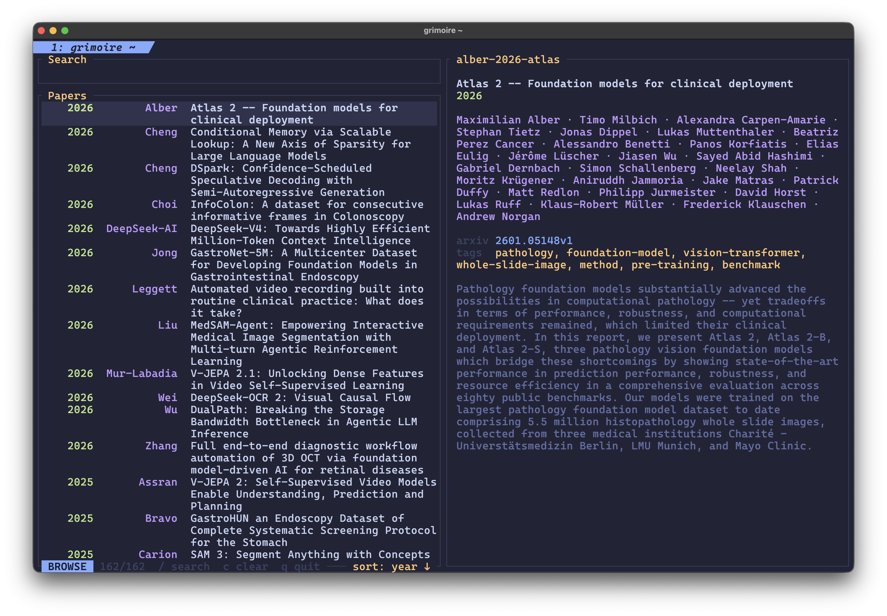

# Grimoire

A fast, local-first scholarly library for papers and books.



## Install

Requires Rust. Kitty and `pdftoppm` (Poppler; `brew install poppler`) are optional and crop formula previews from the source PDF.

```sh
cargo install --path .
```

`just install` is that build with `--locked`, plus an ad-hoc codesign on macOS. `just check-all` runs fmt, check, clippy, and tests.

Hosts whose `libstdc++` predates GCC 12 fail to link ONNX Runtime (`undefined symbol: std::...`). Build on GCC 12 or newer and carry the C++ runtime in the binary:

```sh
RUSTFLAGS="-C link-args=-static-libstdc++ -C link-args=-static-libgcc" \
  cargo install --path . --locked --force
```

`ldd` on the result should not list `libstdc++.so`.

## Usage

```
grimoire                        # browse; a trailing word pre-fills search
grimoire add 1706.03762         # arXiv id, DOI, URL, or PDF; each input is separate
grimoire add --kind book --title "Understanding Analysis" --author "Stephen Abbott" book.pdf
grimoire import-derived abbott-2015-understanding --docling document.json
grimoire list --tag video
grimoire show vaswani-2017-attention
grimoire search "attention model"
grimoire semantic "retrieval limitations"
grimoire path vaswani-2017-attention
grimoire cite --format typst    # plain, latex, typst; omit the key to pick
grimoire update KEY --add-tag foundational   # dry run; --apply writes
grimoire enrich KEY             # enrich --all for the library; --apply writes
grimoire dedup                  # --keep KEY --apply moves the rest to .trash
grimoire export -f hayagriva    # yaml, json, bibtex, hayagriva; -o file; --tag
grimoire backfill               # --check, --pdfs-only, --abstracts-only
grimoire reindex
grimoire semantic-index         # --force rebuilds every embedding
grimoire validate               # --fix
grimoire completions fish       # bash, zsh, fish, elvish, powershell
```

`show`, `path`, `cite`, `update`, and `enrich` take an exact key. `update` sets title, authors, year, DOI, arXiv id, journal, abstract, and tags. A duplicate DOI or normalized title is skipped unless `add --force`. `validate --fix`, `backfill`, `reindex`, `semantic-index`, and `add` write immediately.

`--json` prints `{ok, data, warnings, errors}` on stdout. Progress goes to stderr. `export` prints its own format; use `export --format json` for a JSON export.

### Keys

| Key | Action |
|-----|--------|
| `j` `k` | Down / up |
| `g` `G` | Top / bottom |
| `/` `i` | Search |
| `v` | Semantic search |
| `enter` | Open the PDF, or confirm search |
| `e` | Edit `info.toml` |
| `y` | Copy BibTeX |
| `o` | Open the DOI or arXiv URL |
| `a` | Add a path, DOI, arXiv id, or URL |
| `r` `R` | Enrich the selection / every incomplete entry |
| `s` | Cycle sort: name, author, year, title |
| `d` | Deduplicate |
| `I` | Reindex |
| `V` | Validate and fix |
| `t` | Browse tags |
| `T` | Switch theme |
| `space` | Full-screen abstract |
| `L` | Cycle layout: full, wide, tall |
| `?` | Help |
| `q` | Quit |

Semantic results are one row per work, ordered by its best passage. `p` or `l` opens that work's passages, `P` switches to the global passage ranking, and `h` or `esc` returns. `enter` opens the PDF at the indexed page.

## Library

```
~/Papers/vaswani-2017-attention/
  info.toml
  vaswani-2017-attention.pdf
  derived/docling/document.json
  derived/docling/passages.jsonl
```

Directories are `{lastname}-{year}-{title-word}`, skipping `a`, `an`, `the`, `on`, `of`, `for`, `in`, `to`, `and`, `with`. Papers and books share one flat `info.toml`. A book sets `kind = "book"` and may set `edition`, `publisher`, `series`, and `isbn`.

## Configuration

Optional. `~/.config/grimoire/config.toml`:

```toml
library = "~/Papers" # default
editor = ["hx"]      # $GRIM_EDITOR, $EDITOR, vi
reader = ["open"]    # $GRIM_READER, then the OS opener
browser = ["open"]   # $GRIM_BROWSER, $BROWSER, then the OS opener
theme = "~/.config/themes/tokyo-night-moon.toml"
theme_catalog = "~/.config/themes/catalog.toml" # themes = ["..."]
layout = "full"      # full (default), wide, tall, auto
# semantic_results = 25 # TUI cap; omit or 0 returns every match
```

Environment variables override the file. A command is a string or an argument array; Grimoire appends the path or URL. `auto` is wide when the terminal is at least twice as wide as it is tall. The picker reads only the `themes` array in `theme_catalog`, and the choice lasts for the session; set `theme` to change the startup theme. [`themes/`](themes/) has examples. A missing theme uses the terminal colors. Palette `bg` fills the background; `[ui].background` can name another palette color.

## Helix

```toml
[keys.normal.space.r]
r = [":insert-output grimoire cite", ":redraw"]
t = [":insert-output grimoire cite --format typst", ":redraw"]
l = [":insert-output grimoire cite --format latex", ":redraw"]
```

`Space r t` inserts a Typst citation.

## Import

`grimoire add` detects the input:

- **arXiv id or URL.** Metadata and the PDF.
- **DOI, doi.org URL, or a DOI inside another URL.** CrossRef metadata, then Unpaywall if no PDF is available.
- **PMC URL.** Metadata, plus a publisher or PMC Open Access PDF when one exists.
- **PubMed URL or `PMID:`.** DOI from NCBI, then CrossRef.
- **Publisher page** (Nature, ScienceDirect, Springer). `citation_doi` and `citation_pdf_url`.
- **PDF URL.** Saved when the body is a PDF.
- **Local PDF.** Metadata from the file. An arXiv-like filename is looked up.
- **Local book.** `--kind book` with any of `--title`, `--author`, `--year`, `--edition`, `--publisher`, `--series`, `--isbn`, and `--doi`, on one PDF.

JavaScript-rendered and bot-protected pages (IEEE Xplore, MDPI behind Cloudflare) need a DOI. In the TUI, `d` groups entries that share a title or a DOI.

## Browser extension

Add the paper you're viewing to your library from **Chrome, Edge, Brave,
Vivaldi, Firefox, or Safari** — one click or ⌘⇧G / Ctrl+Shift+G. The extension
sends the current tab (arXiv, DOI, PubMed, publisher page, or PDF link) to the
same smart importer above. Nothing leaves your machine: it talks to a local
`grimoire browser-host` process via the browser's native-messaging protocol.

```sh
just build-extension                          # writes dist/chrome and dist/firefox
# load dist/chrome (or dist/firefox) as an unpacked extension, then:
grimoire install-browser-host --extension-id <extension-id>
```

Full setup, Safari packaging, and troubleshooting are in
[`extension/README.md`](extension/README.md).

## Semantic search

`semantic-index` embeds every `*.jsonl` file under `derived/` into `.grimoire.db`. A source is fingerprinted by its content and the work title: new and changed files are embedded, deleted files are removed, and the rest are kept. `--force`, or a changed embedding profile, rebuilds the index. Passage text comes from `text`, `content`, `page_content`, or `raw_text`; headings, pages, and chunk ids are optional, and the original JSON is kept.

The model is a pinned Q4 ONNX export of EmbeddingGemma 300M, downloaded once and cached. Text stays on the machine. Downloads honor `HF_ENDPOINT` and a PEM bundle in `SSL_CERT_FILE`, `REQUESTS_CA_BUNDLE`, or `CURL_CA_BUNDLE`.

The CLI returns 100 works, ranked by the best passage. `--limit` and `--offset` page; `--all` returns the rest. `--per-paper N` attaches passages. `--group passages` ranks passages globally. `--exact` keeps passages whose text or headings contain every query term, then ranks that subset by cosine similarity. Grouped JSON includes `total_passages`, `total`, `offset`, `returned`, and `next_offset`, and each work includes its best score, match count, and passages.

`import-derived KEY --docling document.json` stores the Docling JSON and writes `derived/docling/passages.jsonl`. Kept: headings, pages, prose, lists, code, and LaTeX. Dropped: page furniture, OCR of labels inside figures, and page-render PNGs. Spaced inline math is tightened for the terminal (`( a n )` becomes `(aₙ)`, and likewise brackets, subscripts, and number sets); the TUI applies that on display. In Kitty, a formula is cropped from the PDF when Docling recorded its location and `pdftoppm` is available.

The TUI loads 100 rows and fetches the next page near the bottom. Set `semantic_results` above zero to cap a view.

Pin the repository and revision. Paths are relative to that repository. `{query}` and `{text}` are required in their templates; `{title}` is optional.

```toml
[embedding]
repo = "onnx-community/embeddinggemma-300m-ONNX"
revision = "5090578d9565bb06545b4552f76e6bc2c93e4a66"
model_file = "onnx/model_q4.onnx"
external_files = ["onnx/model_q4.onnx_data"]
tokenizer_file = "tokenizer.json"
config_file = "config.json"
special_tokens_map_file = "special_tokens_map.json"
tokenizer_config_file = "tokenizer_config.json"
pooling = "mean"               # mean, cls, or none
output = "sentence_embedding" # name, or an ONNX output index
query_template = "task: search result | query: {query}"
document_template = "title: {title} | text: {text}"
max_length = 2048
batch_size = 32
```

## Backfill

`backfill` fills empty fields and leaves populated ones alone. A missing PDF is fetched from Unpaywall, repository copies first, then from a CrossRef link. A missing abstract is fetched from arXiv, CrossRef, or a title search, and other empty fields are filled from the same response. Only open-access PDFs are retrievable. Paywalled papers and publishers that block non-browser clients (Wiley, MDPI, some society journals) stay without a file; a paywall-heavy library may recover about a quarter of its missing PDFs. A later run picks up transient failures and papers that become open access.
